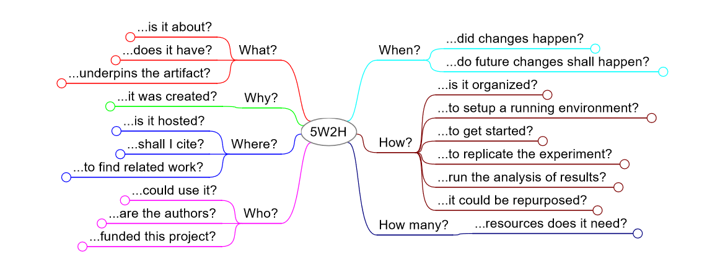

# MDE Artifacts

The *MDE Artifacts* project introduces a set of guidelines for artifact sharing specifically tailored to MDE research.
These guidelines are structured as a *list of factual questions* that cover quality concerns which
artifact authors, reviewers and Artifact Evaluation Committees (AEC) may ask about a research artifact.
For each factual question, we also present a list of research best practices that can be used to
address those respective factual question (i.e., quality concerns).

    
    <em>The 5w2h questions for artifact authoring and sharing in MDE Research</em>

## Project layout

This project is organized as follows:

* [`The 5w2h method`](/intro5w2h) - An introduction to the 5w2h method, a simple but useful framework for artifact authoring and reviewing.
* [`Guidelines for MDE artifact sharing`](/guidelines) - List of research best practices for MDE artifact sharing.
* [`Derived Papers and Artifacts`](relwork) - Lists of assets derived from this project.